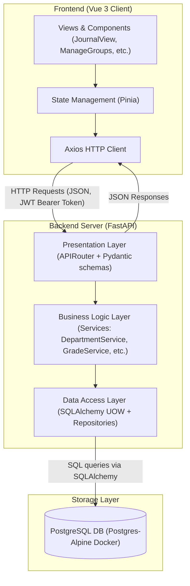
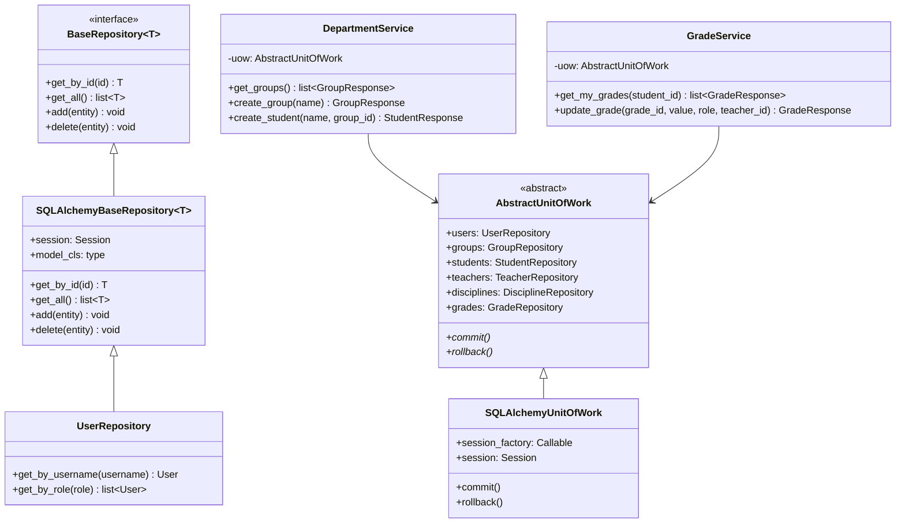
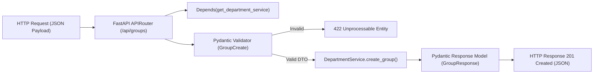

# МІНІСТЕРСТВО ОСВІТИ І НАУКИ УКРАЇНИ
# НАЦІОНАЛЬНИЙ АВІАЦІЙНИЙ УНІВЕРСИТЕТ
## ФАКУЛЬТЕТ КОМП’ЮТЕРНИХ НАУК ТА ТЕХНОЛОГІЙ
## Кафедра інженерії програмного забезпечення

<br/><br/><br/><br/>

# КУРСОВА РОБОТА
### з дисципліни «Архітектура та проєктування програмного забезпечення»
### на тему: «Проєктування та розробка програмної системи з Web-інтерфейсом "Електронна кафедра"»

<br/><br/><br/><br/>

**Виконали:**
### студенти групи Б-121-24-3-ПІ

### Світличний Дмитро

### Сорочан Ярослав


<br/><br/><br/><br/>
<div style="text-align: center;">Київ — 2026</div>

---

# 10.2. Зміст
- [10.3. Загальне завдання та варіант](#103-загальне-завдання-та-варіант)
- [10.4. Загальна архітектура проекту з поясненням](#104-загальна-архітектура-проекту-з-поясненням)
- [10.5. Описання процесу розробки з використанням системи розподілу версій та відслідковування завдань](#105-описання-процесу-розробки-з-використанням-системи-розподілу-версій-та-відслідковування-завдань)
- [10.6. Діаграми кожного рівня з поясненнями](#106-діаграми-кожного-рівня-з-поясненнями)
- [10.7. Важливі деталі реалізації проекту](#107-важливі-деталі-реалізації-проекту)
  - [10.7.1. Технології для роботи з даними (Repository та Unit of Work)](#1071-технології-для-роботи-з-даними-repository-та-unit-of-work)
  - [10.7.2. Ізоляція між DAL та BLL](#1072-ізоляція-між-dal-та-bll)
  - [10.7.3. Передача даних з DAL в BLL та їх використання](#1073-передача-даних-з-dal-в-bll-та-їх-використання)
  - [10.7.4. Ізоляція між BLL та PL](#1074-ізоляція-між-bll-та-pl)
  - [10.7.5. Передача даних в PL](#1075-передача-даних-в-pl)
  - [10.7.6. Структура HTTP-запитів та маршрутизація в PL](#1076-структура-http-запитів-та-маршрутизація-в-pl)
  - [10.7.7. Тестовий фреймворк та ізоляція модульних тестів](#1077-тестовий-фреймворк-та-ізоляція-модульних-тестів)
  - [10.7.8. Механізм обробки виняткових ситуацій](#1078-механізм-обробки-виняткових-ситуацій)
- [10.8. Інструкції з використання застосування](#108-інструкції-з-використання-застосування)
- [10.9. Висновки](#109-висновки)
- [10.10. Використані джерела](#1010-використані-джерела)

---

# 10.3. Загальне завдання та варіант

### Метод вибору варіанта завдання
Відповідно до методичних вказівок, варіант завдання визначається за формулою:
$$\text{Варіант} = (NN \pmod{10}) + 1$$
де $NN$ – останні дві цифри номера студентського квитка першого за алфавітом студента в команді.

**Дані студента:**
- Прізвище, Ім'я: `Світличний Дмитро`
- Номер студентського квитка: `[KB 15280689]`
- Розрахунок: $89 \pmod{10} + 1 = 9 + 1 = 10$.
- **Варіант завдання:** **10 («Електронна кафедра»)**.

### Опис варіанта 10: «Електронна кафедра»
Програмна система призначена для автоматизації процесів обліку навчального навантаження, інформації про викладацький склад, студентів, навчальні групи, дисципліни, а також для ведення журналу успішності (оцінювання) на кафедрі.

**Вимоги та компоненти системи:**
1. **Підсистема додавання та редагування сутностей:**
   - Управління даними викладачів (ПІБ, посада, закріплені дисципліни).
   - Управління академічними групами (назва).
   - Управління студентами (ПІБ, приналежність до групи, автоматичне створення облікового запису).
   - Управління навчальними дисциплінами (назва, опис).
2. **Підсистема виведення та пошуку:**
   - Відображення списків груп, студентів, викладачів та дисциплін.
   - Сортування та фільтрація даних (наприклад, фільтрація оцінок за викладачами/дисциплінами).
3. **Підсистема оцінювання:**
   - Ведення журналу оцінок.
   - Права викладача на виставлення та редагування оцінок студентам лише з тих дисциплін, які даний викладач викладає.
   - Можливість студентів переглядати виключно власні оцінки.
4. **Ролі користувачів:**
   - **Адміністратор (Admin):** Повний доступ до всіх підсистем, конфігурації кафедри та користувачів.
   - **Менеджер (Manager):** Можливість створювати/редагувати викладачів, студентів, групи та дисципліни.
   - **Викладач (Teacher):** Виставлення оцінок з дисциплін, закріплених за ним, перегляд журналу своєї дисципліни.
   - **Студент (Student):** Перегляд особистого журналу успішності (оцінок).
   - **Неавторизований користувач:** Перегляд загальної інформації про кафедру, список викладачів та дисциплін (без доступу до персональних даних студентів та журналу оцінок).

---

# 10.4. Загальна архітектура проекту з поясненням

Проєкт розроблено за принципом багатошарової архітектури (**N-Tier Layered Architecture**), що забезпечує чітке розділення відповідальності (**Separation of Concerns**), слабку пов'язаність (**Loose Coupling**) компонентів та полегшує тестування і супровід системи.

Система складається з двох основних частин:
1. **Frontend (Клієнтська частина):** SPA-застосування на базі фреймворку **Vue 3** з використанням **Vite** як інструменту збірки, бібліотеки компонентів **PrimeVue** та **TailwindCSS** для побудови преміального користувацького інтерфейсу.
2. **Backend (Серверна частина):** RESTful API на базі **FastAPI** (Python 3.10+), структуроване на три основні шари:
   - **Presentation Layer (PL) / Рівень представлення**
   - **Business Logic Layer (BLL) / Рівень бізнес-логіки**
   - **Data Access Layer (DAL) / Рівень доступу до даних**

### Складові рівні архітектури Backend
* **Data Access Layer (DAL):**
  - Відповідає за взаємодію з реляційною базою даних PostgreSQL.
  - Містить декларативні моделі даних SQLAlchemy (`models.py`), конфігурацію підключення до БД (`database.py`).
  - Реалізує патерни **Repository** (для абстракції операцій CRUD) та **Unit of Work** (для управління транзакціями та сесіями бази даних).
* **Business Logic Layer (BLL):**
  - Реалізує бізнес-правила системи (наприклад, перевірку прав викладача на виставлення оцінки, логіку автоматичної генерації логінів для нових студентів).
  - Містить сервісні класи (`AuthService`, `DepartmentService`, `GradeService`).
  - Визначає кастомні доменні винятки (`exceptions.py`).
  - Не залежить від деталей реалізації HTTP-запитів чи конкретної СУБД (взаємодіє з базою виключно через інтерфейс `AbstractUnitOfWork`).
* **Presentation Layer (PL):**
  - Приймає вхідні HTTP-запити від Vue.js клієнта, здійснює маршрутизацію (Routing) та повертає HTTP-відповіді у форматі JSON.
  - Містить API-роутери (`auth.py`, `department.py`, `grades.py`).
  - Використовує схеми **Pydantic** (`schemas.py`) для валідації вхідних даних та серіалізації відповідей.
  - Використовує вбудований у FastAPI механізм Dependency Injection (DI) для впровадження бізнес-сервісів та контролю прав доступу на основі ролей (JWT Token Authentication).

Взаємодія шарів виконується в одному напрямку: `PL -> BLL -> DAL`.

---

# 10.5. Описання процесу розробки з використанням системи розподілу версій та відслідковування завдань

### Система контролю версій (VCS)
Для спільної роботи над проєктом використовувався репозиторій **GitHub**.
- **Адреса репозиторію:** `https://github.com/study-uni/Term-paper-2y2t`
- Доступ до репозиторію та беклогу завдань надано викладачу з правами перегляду та рецензування.

### Стратегія створення та іменування гілок (Branching Strategy)
В проєкті використовувалася модель **GitHub**:
- **`main`**: Стабільна гілка. Код у цій гілці завжди є працездатним, протестованим та готовим до розгортання. 
- **`frontend`**: Гілка для інтеграції інтерфейсу користувача.


### Підхід до об’єднання коду (Merge Strategy)
Об'єднання коду здійснювалося через **Pull Requests (PR)** у гілку `main`.
1. Розробник створює гілку для своєї задачі, виконує роботу.
2. Локально запускається перевірка коду налаштована через `Taskfile.yml`).
3. Створюється Pull Request в GitHub.
4. Інші члени команди перевіряють зміни (Code Review).
5. Після схвалення та успішного проходження автоматичних перевірок виконується злиття (`Merge pull request`).


---

# 10.6. Діаграми кожного рівня з поясненнями

Нижче наведено UML діаграми, які демонструють логічну структуру та взаємодію компонентів системи.

### 1. Загальна схема взаємодії рівнів (Component Diagram)
Ця діаграма показує загальну взаємодію між клієнтом (Frontend SPA) та шарами Backend API.



### 2. Діаграма рівнів DAL та BLL (Class Diagram)
Схема взаємодії між репозиторіями, сутностями БД, Unit of Work та бізнес-сервісами.



### 3. Діаграма рівня представлення PL (Data Flow Diagram)
Показує, як HTTP запити обробляються роутером, проходять валідацію схем та впровадження залежностей.



---

# 10.7. Важливі деталі реалізації проекту

## 10.7.1. Технології для роботи з даними (Repository та Unit of Work)
Для роботи з базою даних використовуються такі технології:
* **PostgreSQL 16 (Alpine)** – реляційна СУБД, запущена в ізольованому Docker-контейнері.
* **SQLAlchemy 2.0** – об’єктно-реляційне відображення (ORM). Використовується сучасний декларативний стиль опису моделей із застосуванням типізації `Mapped[...]` та `mapped_column()`.
* **psycopg2-binary** – драйвер (адаптер) бази даних для взаємодії Python із PostgreSQL.

### Патерни Repository та Unit of Work
* **Repository (Репозиторій):**
  Був реалізований для абстрагування прямої роботи з ORM-сесією. Бізнес-логіка не знає про деталі виконання запитів (фільтри, джоіни).
  Реалізовано базовий generic-клас `SQLAlchemyBaseRepository[T]`, який надає типові CRUD-операції (`get_by_id`, `get_all`, `add`, `delete`).
  Конкретні репозиторії (наприклад, `UserRepository`, `GradeRepository`) успадковують базовий клас і розширюють його унікальними методами:
  ```text
  class UserRepository(SQLAlchemyBaseRepository[User]):
      def get_by_username(self, username: str) -> User | None:
          return self.session.query(User).filter(User.username == username).first()
  ```
* **Unit of Work (UoW, Одиниця роботи):**
  Об’єднує всі репозиторії та забезпечує виконання бізнес-транзакції як єдиного атомарного процесу. Наш `SQLAlchemyUnitOfWork` використовує менеджер контексту `with` для автоматичного відкриття, закриття сесій БД та відкату (`rollback`) транзакції у разі виникнення помилки:
  ```text
  with self.uow:
      # Всі операції виконуються в межах однієї транзакції
      student = self.uow.students.get_by_id(student_id)
      # ...
      self.uow.commit() # Фіксація транзакції
  ```

### Чому (не) були використані узагальнення (Generics)
Узагальнення (`Generic[T]` та `TypeVar("T")`) були використані для **базового репозиторію** (`BaseRepository`), оскільки операції отримання сутності за ідентифікатором, вибірка повного списку та видалення є однаковими для всіх таблиць бази даних. Це дозволило уникнути дублювання коду (принцип **DRY**).

Проте для **Unit of Work** та **специфічних запитів** узагальнення не застосовувалися. Кожна сутність має свої бізнес-вимоги: пошук користувача за логіном, вибірка журналу оцінок конкретного викладача тощо. Спроба зробити абсолютно всі методи узагальненими призвела б до перевантаження системи складними динамічними фільтрами та погіршила б статичну типізацію (яку перевіряє `pyright`).

---

## 10.7.2. Ізоляція між DAL та BLL
Ізоляція реалізована за допомогою **інверсії залежностей** (Dependency Inversion, літера **D** в **SOLID**).
* Шаблони сервісів бізнес-логіки (BLL) приймають об'єкт Unit of Work через його абстрактний інтерфейс `AbstractUnitOfWork`.
* BLL не має доступу до об'єктів `SessionLocal`, `engine` або безпосередніх функцій SQLAlchemy.
* Всі звернення до бази здійснюються виключно через атрибути-репозиторії, надані UoW (наприклад, `self.uow.students.add(...)`).
* Це дозволяє легко замінити реальний `SQLAlchemyUnitOfWork` на тестовий заглушку (`MockUnitOfWork`), яка взагалі не використовує базу даних, а працює зі списками в оперативній пам'яті (in-memory).

---

## 10.7.3. Передача даних з DAL в BLL та їх використання
Дані з DAL передаються до BLL у вигляді об’єктів ORM-моделей SQLAlchemy (класи успадковані від `Base`, такі як `Student`, `Teacher`, `Grade`).
* **Використання в BLL:** Сервіси BLL працюють з цими об'єктами в межах активної транзакції (контексту UoW). Вони можуть змінювати атрибути моделей (наприклад, `grade.grade = grade_value`), читати зв'язані сутності через Lazy/Eager Loading (наприклад, `grade.student.name`).
* **Важливе обмеження:** BLL не повертає моделі DAL назовні (у рівень представлення PL). Перед виходом з методу сервісу дані обов’язково маплять (трансформують) у структури даних PL – Pydantic Response моделі (DTO). Це запобігає виникненню помилок типу `DetachedInstanceError` в PL після закриття сесії БД та повністю приховує структуру бази даних від клієнта.

---

## 10.7.4. Ізоляція між BLL та PL
Ізоляція між рівнем бізнес-логіки та представлення реалізована за рахунок:
1. **Dependency Injection (DI) в FastAPI:**
   Ендпоінти роутерів не створюють об'єкти сервісів власноруч через `new / init`. Замість цього вони отримують готові екземпляри за допомогою `Depends()`:
   ```text
   @router.get("/groups")
   def get_groups(service: DepartmentService = Depends(get_department_service)):
       return service.get_groups()
   ```
2. **DTO (Data Transfer Objects):**
   PL взаємодіє з BLL виключно через DTO (Pydantic-моделі). Роутер не знає, які саме таблиці і зв'язки існують у базі даних, він бачить лише структуровані класи даних, такі як `StudentCreate` або `TeacherResponse`.

---

## 10.7.5. Передача даних в PL
Дані передаються в PL у вигляді Pydantic-моделей (наприклад, `GradeResponse`, `DisciplineResponse`).
* Коли метод сервісу повертає таку модель, FastAPI автоматично перевіряє її валідність на основі анотацій типів, серіалізує в JSON та формує HTTP-відповідь із відповідними заголовками (`Content-Type: application/json`).
* Для зворотного потоку (від клієнта до PL), FastAPI автоматично парсить JSON з тіла HTTP-запиту, валідує його через відповідну Pydantic-модель (наприклад, `GradeUpdate`), і у разі помилки валідації одразу повертає клієнту статус `422 Unprocessable Entity`, не навантажуючи бізнес-логіку.

---

## 10.7.6. Структура HTTP-запитів та маршрутизація в PL
В системі реалізовано RESTful API. Всі запити згруповані за призначенням та використовують правильні HTTP-методи для операцій:
- `GET` – читання даних.
- `POST` – створення нових ресурсів.
- `PUT` – повне оновлення ресурсів.
- `DELETE` – видалення.

### Маршрути та структура API
Усі маршрути реєструються з префіксом `/api` в `main.py`.

| Метод | Маршрут | Доступні ролі | Опис |
| :--- | :--- | :--- | :--- |
| **POST** | `/api/auth/login` | Всі | Авторизація користувача (отримання JWT) |
| **POST** | `/api/auth/mock-login`| Всі | Швидкий вхід у режимі симулятора ролей |
| **GET** | `/api/auth/me` | Авторизовані | Отримання профілю поточного користувача |
| **GET** | `/api/department/info` | Всі | Отримання загальних відомостей про кафедру |
| **PUT** | `/api/department/info` | admin | Редагування відомостей про кафедру |
| **GET** | `/api/groups` | Всі | Отримання списку академічних груп |
| **POST** | `/api/groups` | admin, manager | Створення нової навчальної групи |
| **PUT** | `/api/groups/{id}` | admin, manager | Редагування назви групи |
| **DELETE**| `/api/groups/{id}` | admin, manager | Видалення групи |
| **GET** | `/api/students` | Всі | Отримання списку студентів кафедри |
| **POST** | `/api/students` | admin, manager | Додавання студента (генерація User) |
| **DELETE**| `/api/students/{id}`| admin, manager | Видалення студента та його User |
| **GET** | `/api/teachers` | Всі | Отримання списку викладачів |
| **POST** | `/api/teachers` | admin, manager | Додавання викладача (з переліком дисциплін) |
| **GET** | `/api/disciplines` | Всі | Отримання списку навчальних предметів |
| **GET** | `/api/grades/my` | student | Перегляд особистих оцінок студентом |
| **GET** | `/api/grades/journal` | teacher | Журнал оцінок викладача (з автоініціалізацією) |
| **PUT** | `/api/grades/{id}` | teacher, admin | Виставлення або зміна оцінки (0-100 балів) |

---

## 10.7.7. Тестовий фреймворк та ізоляція модульних тестів
Для написання автоматизованих тестів обрано фреймворк **pytest**.

### Чому обрано pytest?
1. **Мінімалістичний синтаксис:** Тести пишуться як звичайні функції, що не потребують успадкування від громіздких класів (як у стандартному `unittest`).
2. **Потужний механізм фікстур (fixtures):** Дозволяє легко налаштовувати тестове оточення, керувати транзакціями та перевизначати залежності (Dependency Overrides).
3. **Екосистема:** Зручне інтегрування з інструментами аналізу покриття коду та асинхронного тестування.

### Ізоляція модульних тестів (Unit Tests)
Модульні тести для шару бізнес-логіки (BLL) повністю ізольовані від бази даних та мережі за допомогою **Mock-об'єктів** (`unittest.mock.MagicMock`).
* Замість реального підключення до бази даних у конструктор сервісу передається `MagicMock()`, який симулює поведінку `AbstractUnitOfWork`.
* Ми налаштовуємо повертані значення репозиторіїв та перевіряємо, чи викликалися методи коміту транзакцій:
  ```text
  def test_create_group_already_exists():
      # Arrange
      mock_uow = MagicMock()
      # Симулюємо, що група з такою назвою вже є в базі даних
      mock_uow.groups.get_by_name.return_value = Group(id=1, name="Б-121-24-3")
      service = DepartmentService(mock_uow)

      # Act & Assert
      with pytest.raises(GroupAlreadyExistsException):
          service.create_group("Б-121-24-3") # Має викинути помилку

      mock_uow.groups.add.assert_not_called() # Перевіряємо, що додавання не відбулося
      mock_uow.commit.assert_not_called() # Перевіряємо, що транзакція не зафіксована
  ```
Для інтеграційних тестів API (`test_api.py`) використовується механізм перевизначення залежностей FastAPI (`app.dependency_overrides`). Під час запусків створюється тимчасова база даних SQLite у файлі (`test_api.db`), яка наповнюється тестовими даними (`seed_db`) перед початком тестів та повністю видаляється після їх завершення. Це гарантує, що тестові запуски ніяк не впливають на локальну робочу базу даних PostgreSQL.

---

## 10.7.8. Механізм обробки виняткових ситуацій
Обробка помилок у проєкті побудована за ієрархічним принципом:
1. **BLL Рівень:**
   Визначає базовий клас винятку `BllException(Exception)` та його спадкоємців для конкретних бізнес-помилок:
   - `GroupNotFoundException`, `StudentNotFoundException` – коли сутність не знайдена.
   - `GroupAlreadyExistsException` – спроба створити дублікат назви групи.
   - `AccessDeniedException` – спроба викладача редагувати оцінку з чужого предмету.
   Сервіси BLL викидають (`raise`) ці винятки, коли бізнес-правило порушено.
2. **PL Рівень (APIRouter):**
   У функціях контролерів використовуються блоки `try-except` для перехоплення доменних помилок BLL та їх перетворення у стандартні для веб-застосувань `HTTPException`:
   ```text
   @router.post("/groups", response_model=GroupResponse)
   def create_group(group_data: GroupCreate, service: DepartmentService = Depends(get_department_service)):
       try:
           return service.create_group(group_data.name)
       except GroupAlreadyExistsException as e:
           raise HTTPException(
               status_code=status.HTTP_400_BAD_REQUEST, detail=str(e)
           ) from e
   ```
   Це дозволяє повертати клієнту стандартизовані HTTP-статуси (400, 403, 404) та зрозумілі повідомлення про помилку у форматі JSON.

---

# 10.8. Інструкції з використання застосування

### Системні вимоги
- Встановлений **Docker** та **Docker Compose** (рекомендований спосіб запуску).
- Опціонально для локального запуску без Docker: Python 3.10+ (з встановленим `poetry`) та Node.js (версії 18+).

### Спосіб 1: Запуск через Docker Compose (Рекомендовано)
Усі сервіси (СУБД PostgreSQL, Backend FastAPI та Frontend Vue.js) повністю контейнеризовані та конфігуруються через `docker-compose.yml`.

1. Відкрийте термінал у кореневій папці проєкту.
2. Запустіть контейнери командою:
   ```bash
   docker compose up -d
   ```
   *Або за наявності утиліти `task`:*
   ```bash
   task dev:run
   ```
3. Docker завантажить необхідні образи, змонтує томи для збереження бази даних, виконає збірку клієнтського застосування та запустить сервер.
4. Після успішного запуску перевірте стан контейнерів:
   ```bash
   docker compose ps
   ```

### Доступ до інтерфейсів застосування
* **Frontend (Користувацький інтерфейс):** `http://localhost:5173`
* **Backend API Swagger UI (Інтерактивна документація):** `http://localhost:8001/docs`

### Спосіб 2: Локальний запуск для розробника

**Запуск Backend:**
1. Перейдіть до папки `backend`:
   ```bash
   cd backend
   ```
2. Встановіть залежності за допомогою Poetry:
   ```bash
   poetry install
   ```
3. Запустіть сервер розробки:
   ```bash
   poetry run uvicorn app.main:app --reload --port 8000
   ```

**Запуск Frontend:**
1. Перейдіть до папки `frontend/electronic-department`:
   ```bash
   cd frontend/electronic-department
   ```
2. Встановіть Node-пакети:
   ```bash
   npm install
   ```
3. Запустіть клієнт:
   ```bash
   npm run dev
   ```

### Тестування та перевірка стилю (Linter)
Усі команди автоматизації описані у `Taskfile.yml`.
* **Запуск тестів:** `poetry run pytest` (або `task test` з кореня).
* **Запуск лінтера:** `poetry run ruff check` (або `task lint`).

### Облікові дані для демонстрації системи (Seeded Users)
При першому запуску база даних автоматично наповнюється початковими даними (файл `seed.py`). Для тестування можна використовувати такі акаунти:

1. **Адміністратор (Admin):**
   - Логін: `admin`
   - Пароль: `adminpassword`
   - Можливості: Керування загальною інформацією кафедри, повні права на додавання/видалення.

2. **Менеджер (Manager):**
   - Логін: `manager`
   - Пароль: `managerpassword`
   - Можливості: Управління списками студентів, груп, дисциплін та викладачів.

3. **Викладач (Teacher):**
   - Логін: `andrii_prokopenko` (Професор Прокопенко А. В.)
   - Пароль: `teacherpassword`
   - Можливості: Виставлення оцінок з дисциплін "Веб-програмування" та "Архітектура ПЗ" для студентів.

4. **Студент (Student):**
   - Логін: `ivan_rudyi_stud` (Студент Рудий І. В., група Б-121-24-3)
   - Пароль: `studentpassword`
   - Можливості: Перегляд власного журналу оцінок (інші оцінки недоступні).

---

# 10.9. Висновки

В ході виконання даної курсової роботи було спроєктовано та розроблено Web-застосування «Електронна кафедра» відповідно до варіанта 10.

Основні результати роботи:
1. **Опановано N-Tier Layered Architecture:** Завдяки чіткому розділенню на шари DAL, BLL та PL вдалося створити гнучку кодову базу. Будь-які зміни в користувацькому інтерфейсі (фронтенді) або структурі збереження даних у БД не впливають на ядро бізнес-логіки.
2. **Впроваджено шаблони Repository та Unit of Work:** Використання патернів дозволило абстрагувати бізнес-сервіси від особливостей роботи СУБД PostgreSQL та SQLAlchemy ORM. Це забезпечило надійне управління транзакціями та запобігло витоку ORM-сутностей за межі транзакційного контексту.
3. **Реалізовано надійну безпеку (Role-Based Access Control):** Завдяки JWT-авторизації та перевірці ролей у FastAPI реалізовано вимоги до розмежування доступу: викладачі мають доступ лише до оцінювання своїх предметів, студенти бачать лише власні результати, а неавторизовані користувачі захищені від перегляду конфіденційних даних.
4. **Написано автоматизовані тести:** Покриття коду тестами за допомогою `pytest` та використання бібліотеки `unittest.mock` дозволили підтвердити працездатність бізнес-правил без необхідності щоразу вручну клікати інтерфейс користувача.
5. **Засвоєно командний процес розробки:** Робота велася за методологією GitHub Flow із використанням дошки завдань GitHub Projects, що дозволило ефективно розподіляти завдання, контролювати етапи виконання та підтримувати стабільний код у гілці `main`.

---

# 10.10. Використані джерела

1. FastAPI official documentation. URL: [https://fastapi.tiangolo.com/](https://fastapi.tiangolo.com/)
2. SQLAlchemy 2.0 documentation. URL: [https://docs.sqlalchemy.org/en/20/](https://docs.sqlalchemy.org/en/20/)
3. Vue 3 official documentation & guide. URL: [https://vuejs.org/guide/introduction.html](https://vuejs.org/guide/introduction.html)
4. Martin Fowler. Patterns of Enterprise Application Architecture. Addison-Wesley Professional, 2002. 544 p.
5. Robert C. Martin. Clean Architecture: A Craftsman's Guide to Software Structure and Design. Prentice Hall, 2017. 432 p.
6. Pytest official documentation. URL: [https://docs.pytest.org/](https://docs.pytest.org/)
7. PrimeVue UI components documentation. URL: [https://primevue.org/](https://primevue.org/)
8. TailwindCSS documentation. URL: [https://tailwindcss.com/](https://tailwindcss.com/)
